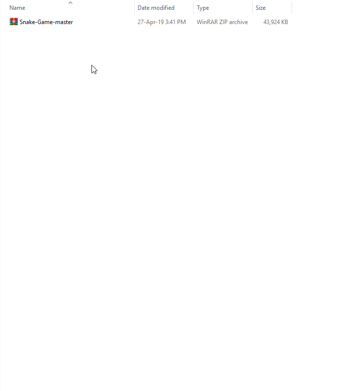

  

## About The Project :scroll:

* "Snake game" is a game that everyone used to play before through during their childhood. We want to revive the classic snake game better (or worse?) but still have the classic feeling.
* This game is part of Subject "Computer Programming" KMITL.

## Special Thanks ❤️
* http://pixelartmaker.com/
* https://textcraft.net/
* https://opengameart.org/
* https://lazyfoo.net/tutorials/SDL/

## Video Presentation (Thai Language) :video_camera:

## Built With :computer:
* C Language.
* Library SDL.

## Download 🔨
* Download zip file from [here](https://github.com/peetck/Snake-Game/archive/master.zip).
* Extract the file.
* Run "Snake Game.exe" to start

  

## Ingame 📷

   

   

# How to play :game_die:
* Press the arrow keys on the keyboard to control the direction of the snake.
* Can press "P" button to pause.
* If you can eat the ladybug, the snake's size will increase and get points.
* If the snake hit itself, the snake will die.
* Able to break through the wall.

## Group Members :family:
||||
|:-:|:-:|:-:|:-:|
|61070218|61070199|61070211|61070221|
|Sarun|Worapat|Visarut|Sirawit|
|Yantabutr|Phatarametravorakul|Phanmaisri|Yodjit|
|[@peetck](https://github.com/peetck)|[@thangmo29](https://github.com/thangmo29)|[@skaferun9](https://github.com/skaferun9)|[@blackjokerrr](https://github.com/blackjokerrr)|

# Assistant Teacher :pray:
 |||
 |:---:|:---:|
 |ผศ. ดร. กิติ์สุชาต พสุภา|ผศ. ดร. ปานวิทย์ ธุวะนุติ|

