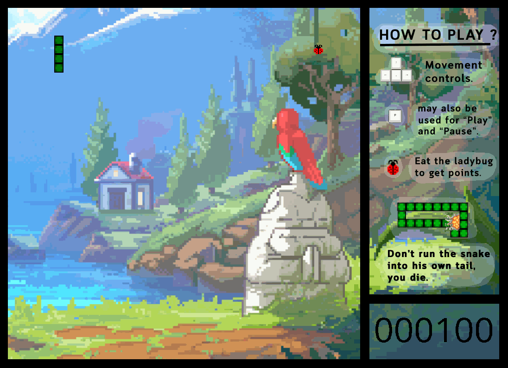

 

  

# Introduction :video_game:
* เกมนี้เป็นส่วนหนึ่งของวิชา Computer Programming KMITL

# How to play :game_die:

* กดปุ่มลูกศรบนคีย์บอร์ดเพื่อควบคุมทิศทางของงู
* สามารถกดปุ่ม "P" เพื่อ pause ได้
* หากกินแมลงเต่าทองได้ขนาดของงูจะเพิ่มขึ้นและได้รับคะแนน
* หากชนตัวเองงูจะตาย
* สามารถทะลุกรอบ/กําแพงได้

# Built With :computer:
* โปรแกรมนี้ ใช้ภาษา C และ Library SDL ในการเขียน

# Ingame :camera:

 

 

 

 

# Special thanks :heart:
* http://pixelartmaker.com/
* https://opengameart.org/
* https://textcraft.net/
* https://lazyfoo.net/tutorials/SDL/

## Group Members :family:

 |||||
 |:---:|:---:|:---:|:---:|
|[peetck](https://github.com/peetck)|[thangmo29](https://github.com/thangmo29)|[skaferun9](https://github.com/skaferun9)|[blackjokerr](https://github.com/blackjokerrr)|
